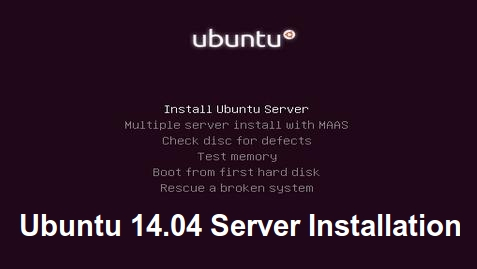

# Welcome to the installation guide of SLNAS

First off all you don't need to have any knowledge of Linux operating system to install and use the software I putted together  in this script, this is specially made to make it possible for everyone to install. 

## Ubuntu installation

#

For installing the Operating System you should follow heading 3 from the next link, remember just for the installation of ubuntu, nothing more.
https://www.howtoforge.com/perfect-server-ubuntu-14.04-apache2-php-mysql-pureftpd-bind-dovecot-ispconfig-3

## Install commands

After the installation has finished you should follow those commands to install the necessary software. It's a good to ssh into your server with an app like putty or for Linux just write ssh user@my_ip_server.

* `sudo -i` - You will be prompted to enter the password from the installation process.

* `wget https://github.com/giumbai/LinuxNAS/archive/master.zip` - Now we download the script and the necessary files.

* `apt-get install unzip` - We need to make sure that unzip is installed so that the next command will work.

* `unzip master.zip` - We are now extracting the archive.

* `cd LinuxNAS-master/Stable/Stable_1.0` - Now we will go in to the desire folder to practically installing the software.

* `./installer.sh` - And now we are running the bash script to continue with th installation.

From now on it's very simple just follow the information from the screen and answer accordingly with what you want to install. Best practice you answer all yes (y) and when asked for virtual box, if you want it select the corresponding number or quit, the installer will continue with the next process. Don't forget to get the plex mobile application, i find it very useful. 

##Useful links
*http://www.makeuseof.com/tag/plex-a-manual-your-media-with-style/#chapter-3

*http://download.virtualbox.org/virtualbox/UserManual.pdf

*http://www.ubuntu.com/download/desktop/install-ubuntu-desktop

## Credits
A lot of thanks to the creators of Utorrent, Plex Media Server, Uubntu, VirtualBox
